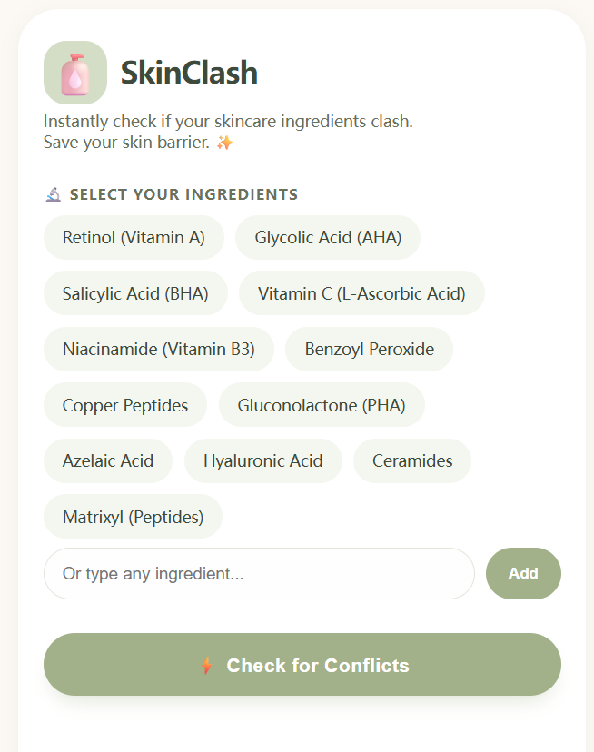
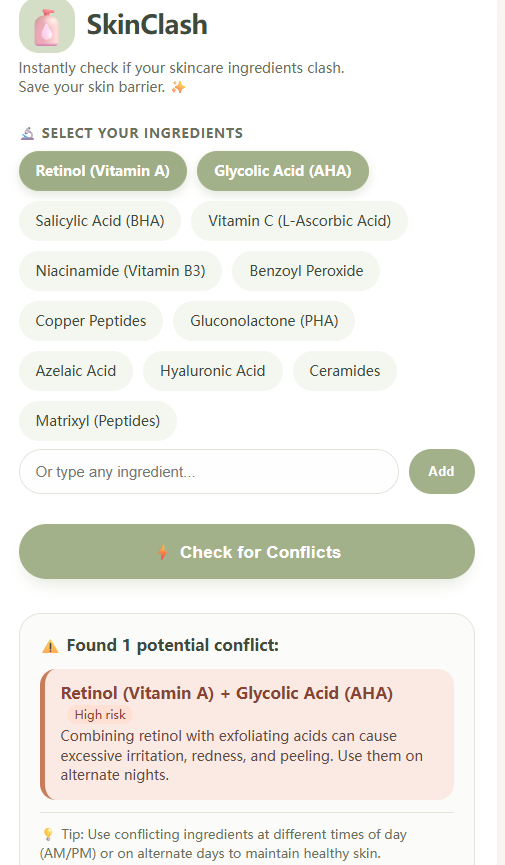

# SkinClash ✨ – Skincare Ingredient Conflict Checker

**Stop layering ingredients that hate each other.**  
SkinClash instantly checks if your skincare products contain conflicting active ingredients, so you can protect your skin barrier without a science degree.

---

## 🧴 What it does

You select (or type) the ingredients in your current routine.  
One click tells you:

- ⚠️ **Are there risky combinations?** (High / Medium / Low severity)  
- 📝 **What’s the conflict?** – clear, no‑fluff explanations  
- 💡 **How to fix it** – use them in AM vs PM, or on alternate days  

All checks run **entirely in your browser** – no data is ever sent anywhere.  
It's like a skin‑savvy friend who’s always in your pocket.

---

## 🚀 Live demo

👉 **[Open SkinClash]**  
*(https://jasonx1136.github.io/skin-clash/)*

No installation, no sign‑up. Just open the link and start checking.

---

## 📸 Screenshots

| Home screen | Check results |
|-------------|---------------|
|  |  |

*(You can add real screenshots later – they help a lot on Product Hunt and GitHub.)*

---

## 🛠️ How to use

1. **Select your ingredients** – Tap any active you’re currently using (Retinol, Vitamin C, AHA, etc.).  
2. **Add custom ones** – Not in the list? Type any ingredient name and hit **Add**.  
3. **Check conflicts** – Press the green **⚡ Check for Conflicts** button.  
4. **Read the report** – Each conflict shows the risk level and a practical tip.  

---

## 🔬 Included ingredients & conflict rules

The tool ships with **17 common active ingredients** and **9 built‑in conflict rules** covering:

| Pair | Risk | Quick tip |
|------|------|-----------|
| Retinol + AHA / BHA | High | Alternate nights or use acid in AM |
| Retinol + Benzoyl Peroxide | High | Avoid layering; use at different times |
| Vitamin C + Niacinamide | Medium | Wait 10‑15 min between applications |
| Vitamin C + Copper Peptides | Medium | Split into AM / PM routine |
| … and more | | |

You can easily **extend the ingredient list and conflict rules** by editing the arrays in `skin-clash.html`.

---

## 🧪 Tech stack

- ✅ **Pure HTML / CSS / JavaScript** – zero dependencies, zero frameworks
- ✅ **Runs entirely client‑side** – privacy‑first, no backend, no API calls
- ✅ **Responsive & mobile‑first** – use it on your phone in the bathroom or at the store
- ✅ **Host anywhere** – GitHub Pages, Netlify, Vercel, or just double‑click the `.html` file

---

## 🏗️ Run it locally

1. Clone or download this repository  
2. Double‑click `index.html` – it opens in your default browser  
3. That’s it. Start checking.

---

## 🤝 Contributing

Bug reports, feature ideas and pull requests are welcome!  
If you’d like to add more ingredients or conflict rules, feel free to open an issue or a PR.

Check [`CONTRIBUTING.md`](CONTRIBUTING.md) for guidelines (once you add one).

---

## ☕️ Support

If SkinClash saved your skin (or at least stopped you from googling “can I mix…” at midnight), consider:

- **Buying me a coffee** → [buymeacoffee.com/YOUR_ID](https://www.buymeacoffee.com/YOUR_ID)
- **Sharing it** with your skincare‑obsessed friends 💚  
- **Starring this repo** ⭐ – it helps more people find it

---

## 📄 License

MIT © [Your Name or Handle]

---

*Made with ❤️ as a “vibe coding” experiment. Turns out one person + AI can ship useful things in an afternoon.*
